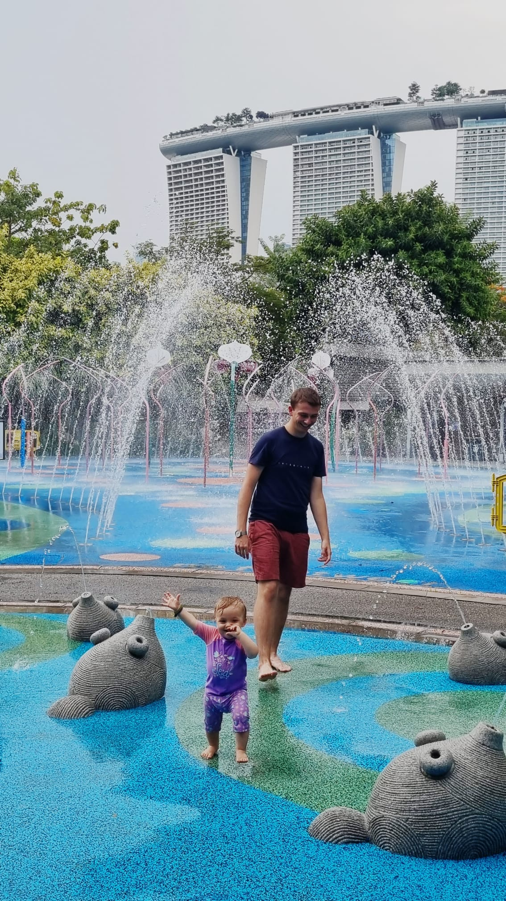

Guten Morgen meine Lieblingsmenschen!

Wie habt ihr geschlafen? Ich hoffe, die Nacht war ruhig und erholsam für euch und ging schnell vorbei!

Vielleicht können wir ja vor der Kita noch kurz Face-Chat machen? Ich vermisse euch nämlich ganz doll!

## Erinnerung

Es fühlt sich an, als wäre dieser Tag eine Ewigkeit her. Wisst ihr noch, wie viel Spaß Edda und wir alle hatten?

## Song für Mama
Ich bin so froh, dass du in meinem Leben bist. Jede Entscheidung und Fehlentscheidung, jeder Erfolg und Fehler in meinem Leben haben mich da hin gebracht, wo ich heute mit euch bin. Und das macht mich unfassbar glücklich!

<iframe width="560" height="315" src="https://www.youtube.com/embed/xkUx5VKgOCQ?si=iUg-7aULdOKln0U0" title="YouTube video player" frameborder="0" allow="accelerometer; autoplay; clipboard-write; encrypted-media; gyroscope; picture-in-picture; web-share" referrerpolicy="strict-origin-when-cross-origin" allowfullscreen></iframe>

## Song für Edda

<iframe width="560" height="315" src="https://www.youtube.com/embed/cR_T1nqhwOs?si=UdadyDKAHAgAGcIM" title="YouTube video player" frameborder="0" allow="accelerometer; autoplay; clipboard-write; encrypted-media; gyroscope; picture-in-picture; web-share" referrerpolicy="strict-origin-when-cross-origin" allowfullscreen></iframe>

***

Ich wünsche euch einen ganz tollen Tag - wir sprechen uns später noch!

Bis dahin, passt auf euch auf. In Liebe, Papabär 🐻

*** 

PS: Das nächste Versteck ist: der Eckschrank in der Küche!
